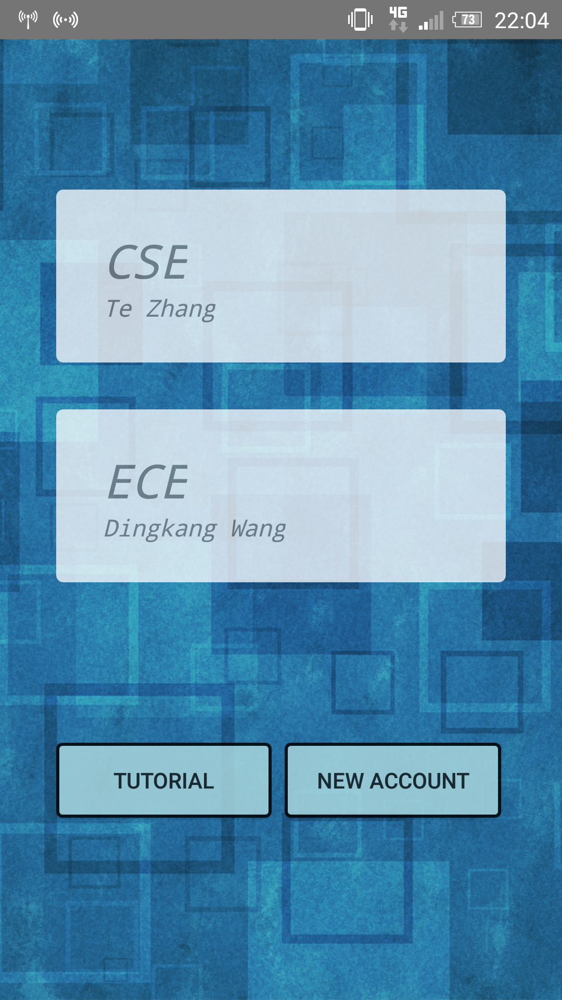
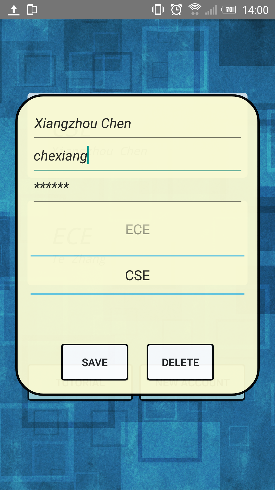
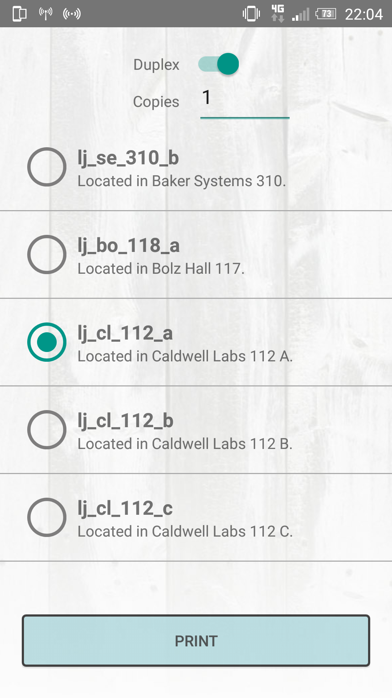
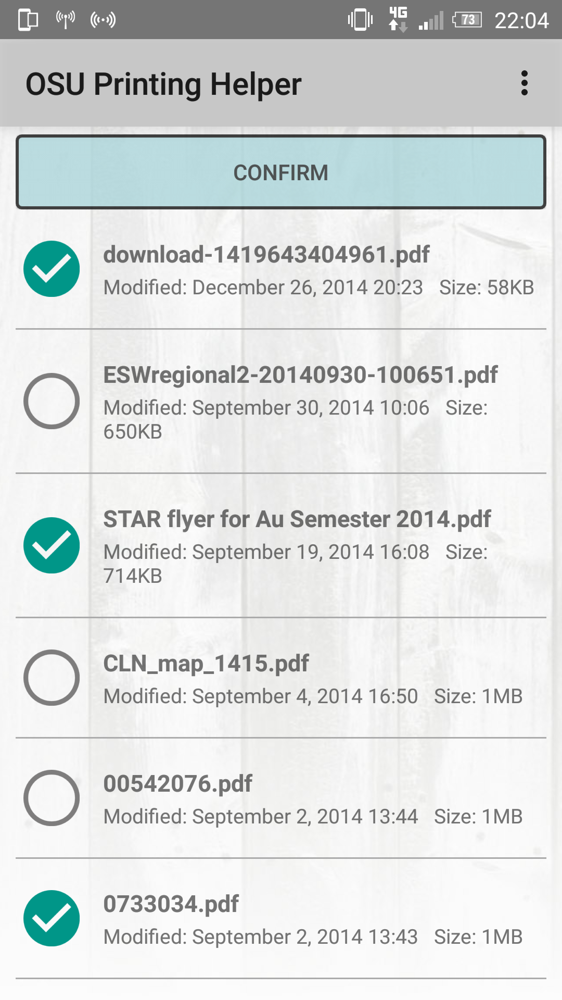
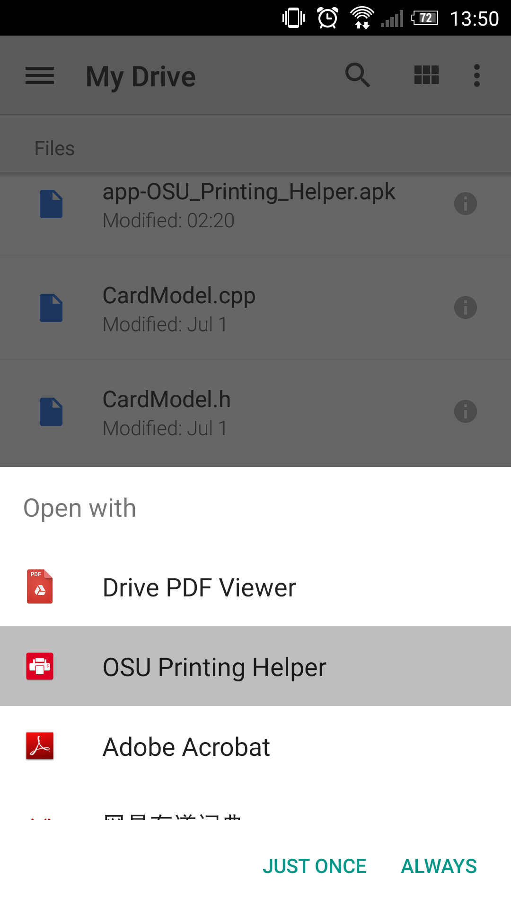
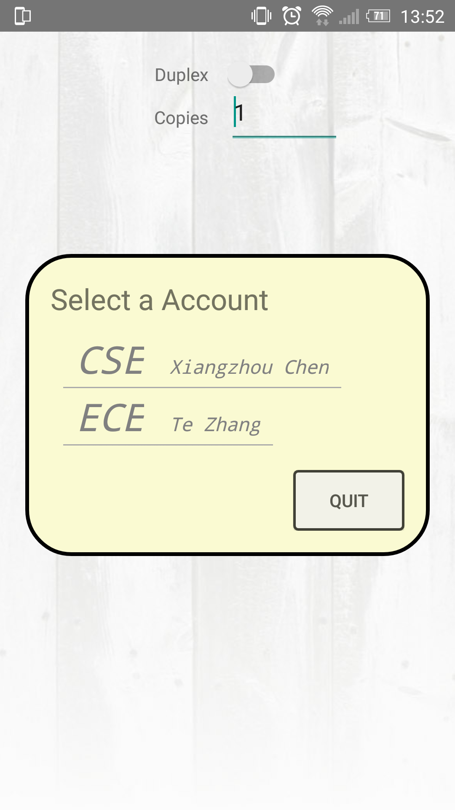

# OSU_PrintingHelper_Android 

### Introduction
This is a printing application for the Ohio State University.
The intention of creating this application is to help student to 
print their documents using department printers more efficiently. 
The project currently is still under construction.

### Usage

To get started, first create a new account and put in the information 

### Credit
Author: Xiangzhou Chen  
Email: chen.4835@osu.edu  

### Other
If you like it, please feel free to recommend to your friend.  
**Thank you!**
